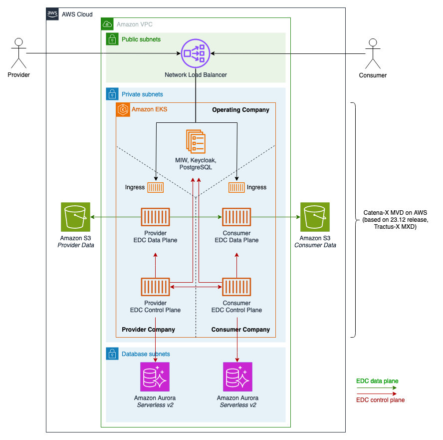

# Minimum Viable Dataspace for Catena-X on AWS

In October 2023, the Catena-X Automotive Network was productively launched. [Catena-X](https://catena-x.net/) aims to create greater transparency by building a trustworthy, collaborative, open and secure data ecosystem for the automotive industry. [AWS joined Catena-X](https://aws.amazon.com/blogs/industries/aws-joins-catena-x/) as a member in January 2023.

This sample extends Catena-X' [Tractus-X MXD implementation](https://github.com/eclipse-tractusx/tutorial-resources/tree/main/mxd) to deploy a single-command Minimum Viable Dataspace (MVD) for Catena-X on AWS. For users, this serves as a starting point for experimentation around Catena-X onboarding, implementation against the Eclipse Dataspace Components' (EDC) API and realization of initial use cases. **This repository provides a reference implementation for Catena-X release [24.03](https://github.com/eclipse-tractusx/tractus-x-release/blob/main/CHANGELOG.md#2403---2024-03-08) on AWS.**

## Architecture



## Getting Started

This project requires `terraform`, `aws-cli`, `kubectl` and `git` to be installed. To provision the MVD on AWS sample run

```bash
~ ./deploy.sh up

Creating Minimum Viable Dataspace for Catena-X on AWS...
Please enter an alphanumeric string to protect access to your connector APIs.
EDC authentication key:
```

Enter a secret key that you would like the MVD sample to configure for access with the EDCs' control and data plane APIs and submit.
The deployment will take 15-20 minutes to complete. After the deployment is done, verify the installation by running

```bash
~ kubectl get pod

NAME                                                     READY   STATUS              RESTARTS   AGE
alice-minio-7b4b95cf79-r8jt4                             1/1     Running             0          7m13s
alice-tractusx-connector-controlplane-7ff7b666b9-h24rm   1/1     Running             0          5m2s
alice-tractusx-connector-dataplane-587bf89d6f-tzqmx      1/1     Running             0          5m2s
alice-vault-0                                            1/1     Running             0          5m2s
azurite-7cddb6c555-fjtvd                                 1/1     Running             0          7m29s
backend-service-67dd4b974-h2x2s                          0/1     ErrImageNeverPull   0          7m13s
bdrs-server-6f5d74c55f-m79hc                             1/1     Running             0          7m9s
bdrs-server-vault-0                                      1/1     Running             0          7m9s
bob-minio-54c4d656d6-j7hzh                               1/1     Running             0          7m13s
bob-tractusx-connector-controlplane-5c94c684c-kzvtp      1/1     Running             0          5m1s
bob-tractusx-connector-dataplane-58d6d4464d-q4f4d        1/1     Running             0          5m1s
bob-vault-0                                              1/1     Running             0          5m1s
common-postgres-5847467f7-n6w2m                          1/1     Running             0          7m29s
keycloak-f8794dcb8-bxv5r                                 1/1     Running             0          7m13s
miw-7645f67cf9-fkxbq                                     1/1     Running             0          7m13s

~ kubectl get ing

NAME            CLASS   HOSTS   ADDRESS                                      PORTS   AGE
alice-ingress   nginx   *       <lb-domain>.elb.eu-central-1.amazonaws.com   80      8m14s
bob-ingress     nginx   *       <lb-domain>.elb.eu-central-1.amazonaws.com   80      8m14s
mxd-ingress     nginx   *       <lb-domain>.elb.eu-central-1.amazonaws.com   80      6m7s
```

**Note: Currently, the concluding MXD deployment times out during creation of the `kubernetes_deployment.backend-service` resource, terminating with the error `Waiting for rollout to finish: 1 replicas wanted; 0 replicas Ready`. This is an expected behavior and is due to the MXD's recently added backend service requiring a local Gradle build and loading process of the resulting container image, which this project does not yet support.**

All pods, except for the `backend-service`, should be in a ready state, the seeding jobs should complete successfully. Concludingly, use this project's [Insomnia](https://github.com/aws-samples/minimum-viable-dataspace-for-catenax/tree/main/insomnia) file as a starting point to perform API operations against the MVD's EDC connectors. For further information about the MVD and its components on AWS refer to this repository's [docs section](https://github.com/aws-samples/minimum-viable-dataspace-for-catenax/tree/main/docs).

## Considerations for Production

The default resource configuration of this project is not indended for use in a production scenario. It is intended as a starting point for rapid Catena-X and dataspace experimentation and prototyping, that has to be adapted depending on how it is being used. For design principles and best practices on implementing a production-grade workload on AWS please refer to the [AWS Well-Architected Framework](https://docs.aws.amazon.com/wellarchitected/latest/framework/welcome.html).

### Configuration

The MVD's EDC connectors are exposed over HTTPS through a [Network Load Balancer](https://docs.aws.amazon.com/elasticloadbalancing/latest/network/introduction.html) that is provisioned by the Kubernetes ingress controller. Initially, this project creates a self-signed X.509 certificate that is valid for 30 days and is being exposed to the NLB through [AWS Certificate Manager](https://docs.aws.amazon.com/elasticloadbalancing/latest/network/create-tls-listener.html) (ACM). You can replace this initial certificate by requesting or importing a new one through ACM, and adjusting the NLB's listener configuration accordingly.

The MVD's EDC connectors come with key-based authentication for both their control and data planes that can be configured in this project's [`values.yaml.tpl`](https://github.com/aws-samples/minimum-viable-dataspace-for-catenax/blob/main/templates/values.yaml.tpl) template file. This key then has to be provided as an HTTP header `x-api-key` with every API call to one of the EDCs.

## Troubleshooting

### EDC data transfer ignores `keyName` property in `dataDestination`, instead takes the object key defined by the source

See https://github.com/eclipse-edc/Technology-Aws/issues/238 - this is an intended behavior which was introduced with the `keyPrefix` property.

### EDC data catalog requests are no longer working, resulting in timeouts and authentication errors

In case of EDC data catalog request timeouts, a quick remediation can be to redeploy the MXD. This can be achieved with the following commands

```bash
cd tutorial-resources/mxd/
terraform destroy --auto-approve && sleep 5 && terraform apply --auto-approve
```

Redeploying the Tractus-X MXD to the Kubernetes cluster should take less than 5 minutes to complete.

## Backlog

* Include HTTP backend service to be used in addition to Amazon S3 for `DataAddress` definitions
* Include decentral [Digital Twin Registry](https://github.com/eclipse-tractusx/tutorial-resources/issues/50) into MVD deployment

## Security

See [CONTRIBUTING](CONTRIBUTING.md#security-issue-notifications) for more information.

## License

This library is licensed under the MIT-0 License. See the LICENSE file.
