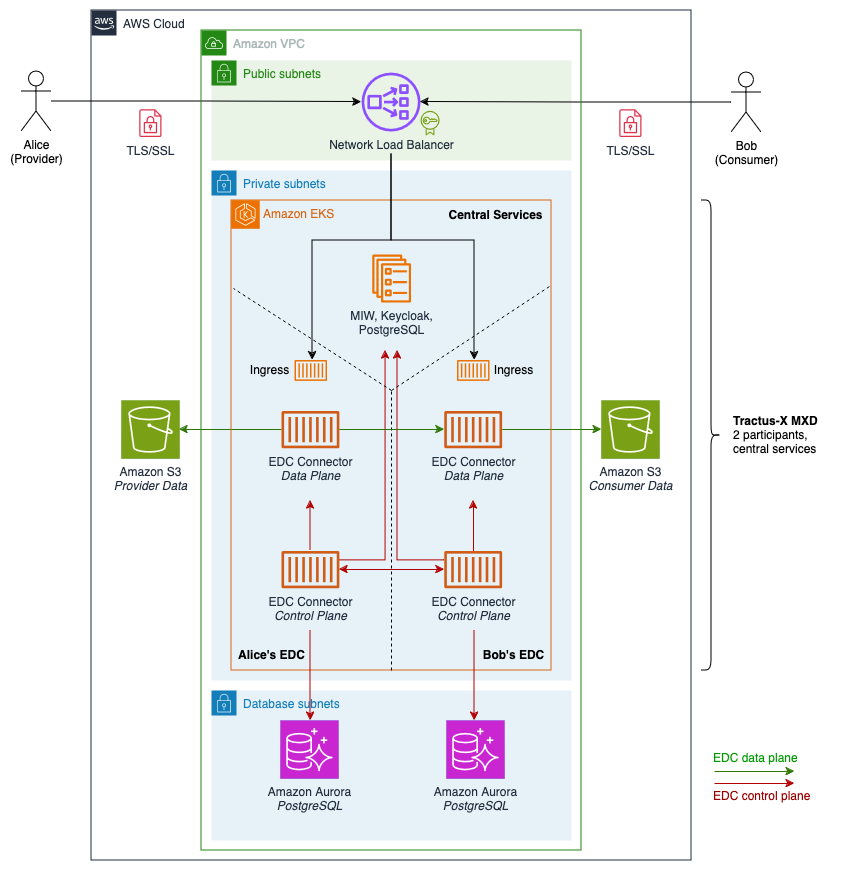

# Minimum Viable Dataspace on AWS

The Catena-X Automotive Network e.V. ([Catena-X](https://catena-x.net/) supports the automotive industry’s transition from peer-to-peer data exchange to an interoperable, transparent network leveraging open standards and industry collaboration. Catena-X is an automotive consortium formed by European automakers and their suppliers focused on creating an automotive-specific “data space”, i.e. a space for decentralized data sharing. The Catena-X data space is designed to improve information flow across the automotive value chain. Catena-X promotes a federated architecture, similar to data a mesh, where providers retain data control and sovereignty, sharing only metadata through a decentralized catalog. Data exchange via Catena-X occurs directly between partners, adhering to usage policies that are contractually agreed on.

This project extends Catena-X' [Tractus-X MXD implementation](https://github.com/eclipse-tractusx/tutorial-resources/tree/main/mxd) to deploy a single-command Minimum Viable Dataspace (MVD) for Catena-X on AWS. For users, this serves as a starting point for experimentation on Catena-X onboarding, implementation against the Eclipse Dataspace Components' (EDC) APIs and testing of initial use cases. **This branch provides a reference implementation for Catena-X release [24.03](https://github.com/eclipse-tractusx/tractus-x-release/blob/main/CHANGELOG.md#2403---2024-03-08) on AWS.**

Beyond Catena-X, sovereign data sharing is emerging as a requirement across countries and industries. This project accelerates data space experimentation and evaluation of use cases by making reference implementations created under the Eclipse Foundation available as single-command deployment blueprints on AWS. In the case of the `mvd` blueprint this includes a web application through which data discovery, contract negotiation and transfers across 2 fictional organizations can be explored in a visual manner.

## Architecture



## Getting Started

This project requires additional dependencies to be installed for MVD deployment

* `corretto@17` and `docker` to build EDC components and container images
* `terraform`, `aws-cli` and `kubectl` to deploy AWS infrastructure and Kubernetes resources
* `git` to access relevant GitHub projects (Eclipse MVD, Eclipse DataDashboard, Tractus-X MXD)

*Minimum Viable Dataspace on AWS* comes with support for two data space blueprints: [Eclipse MVD](https://github.com/eclipse-edc/MinimumViableDataspace) and [Tractus-X MXD](https://github.com/eclipse-tractusx/tutorial-resources/tree/main/mxd). By default, the `mvd` blueprint should be used unless the Catena-X specific implementation of the `mxd` blueprint is of interest.

**Note:** If you're accessing this repository to follow along the blog post *[Rapidly experimenting with Catena-X data space technology on AWS](https://aws.amazon.com/blogs/industries/rapidly-experimenting-with-catena-x-data-space-technology-on-aws/)* you need to use the `mxd` blueprint for deployment. Detailed steps can be found in our [Data Exchange Walk-Through](https://github.com/aws-samples/minimum-viable-dataspace-for-catenax/blob/main/docs/data-exchange-tutorial.md).

To provision the `mvd` data space blueprint on AWS run

```bash
~ ./deploy.sh up mvd

Creating Minimum Viable Dataspace on AWS...
Please enter an alphanumeric string to protect access to your connector APIs.
EDC authentication key:
```

Enter a secret key that you would like the MVD to configure for access to the EDCs' APIs and submit.
The deployment will take 15-20 minutes to complete. After the deployment is done, verify the installation by running

```bash
~ kubectl get pod

NAME                                                   READY   STATUS    RESTARTS   AGE
consumer-controlplane-75fcb7bb6d-pj65b                 1/1     Running   0          2m13s
consumer-dataplane-78444656f7-msjcn                    1/1     Running   0          107s
consumer-identityhub-576f45f8f-qt757                   1/1     Running   0          2m49s
consumer-vault-0                                       1/1     Running   0          2m51s
data-dashboard-59f55d784f-kwmmx                        1/1     Running   0          66s
dataspace-issuer-server-65b999ff84-p5tvg               1/1     Running   0          2m52s
dataspace-issuer-service-64885d858-g2l98               1/1     Running   0          2m36s
issuer-postgres-6cfc666468-hlqjv                       1/1     Running   0          2m52s
provider-catalog-server-646995c96b-666mv               1/1     Running   0          2m13s
provider-identityhub-84dbd6559d-c87p8                  1/1     Running   0          2m49s
provider-manufacturing-controlplane-7fd4bcb986-s7dkv   1/1     Running   0          2m13s
provider-manufacturing-dataplane-597b594d47-n66dc      1/1     Running   0          107s
provider-qna-controlplane-6448d7b4d6-t4s9s             1/1     Running   0          2m13s
provider-qna-dataplane-658bc7788c-qlprf                1/1     Running   0          107s
provider-vault-0                                       1/1     Running   0          2m51s

~ kubectl get ing

NAME                                   CLASS   HOSTS   ADDRESS                                       PORTS   AGE
consumer-did-ingress                   nginx   *        <lb-domain>.elb.eu-central-1.amazonaws.com   80      2m16s
consumer-identityhub-ingress           nginx   *        <lb-domain>.elb.eu-central-1.amazonaws.com   80      2m16s
consumer-ingress                       nginx   *        <lb-domain>.elb.eu-central-1.amazonaws.com   80      85s
data-dashboard                         nginx   *        <lb-domain>.elb.eu-central-1.amazonaws.com   80      69s
dataspace-issuer-service-did-ingress   nginx   *        <lb-domain>.elb.eu-central-1.amazonaws.com   80      2m14s
dataspace-issuer-service-ingress       nginx   *        <lb-domain>.elb.eu-central-1.amazonaws.com   80      2m14s
provider-catalog-server-ingress        nginx   *        <lb-domain>.elb.eu-central-1.amazonaws.com   80      110s
provider-did-ingress                   nginx   *        <lb-domain>.elb.eu-central-1.amazonaws.com   80      2m16s
provider-identityhub-ingress           nginx   *        <lb-domain>.elb.eu-central-1.amazonaws.com   80      2m16s
provider-manufacturing-ingress         nginx   *        <lb-domain>.elb.eu-central-1.amazonaws.com   80      95s
provider-qna-ingress                   nginx   *        <lb-domain>.elb.eu-central-1.amazonaws.com   80      85s
```

The included [EDC Data Dashboard](https://github.com/eclipse-edc/DataDashboard) will be accessible under `https://<lb-domain>.elb.eu-central-1.amazonaws.com/dashboard/`.

All pods should be in a ready state, the seeding jobs should complete successfully. Next, use this project's [Insomnia](https://github.com/aws-samples/minimum-viable-dataspace-for-catenax/tree/main/insomnia) file as a starting point to perform API operations against the MVD's EDC connectors. For further information about the MVD and its components on AWS refer to this repository's [docs section](https://github.com/aws-samples/minimum-viable-dataspace-for-catenax/tree/main/docs). For an end-to-end walkthrough explaining the deployment and initial use of the `mxd` blueprint please refer to the blog post *[Rapidly experimenting with Catena-X data space technology on AWS](https://aws.amazon.com/blogs/industries/rapidly-experimenting-with-catena-x-data-space-technology-on-aws/)*.

## Considerations for Production

The default resource configuration of this project is not indended for use in a production scenario. It is intended as a starting point for rapid Catena-X and data space experimentation and prototyping, that has to be adapted depending on how it is being used. For design principles and best practices on implementing production-grade workloads on AWS please refer to the [AWS Well-Architected Framework](https://docs.aws.amazon.com/wellarchitected/latest/framework/welcome.html).

### Configuration

The MVD's EDC connectors and DataDashboard are exposed over HTTPS through a [Network Load Balancer](https://docs.aws.amazon.com/elasticloadbalancing/latest/network/introduction.html) that is provisioned by the Kubernetes ingress controller. Initially, this project creates a self-signed X.509 certificate that is valid for 30 days and is being exposed to the NLB through [AWS Certificate Manager](https://docs.aws.amazon.com/elasticloadbalancing/latest/network/create-tls-listener.html) (ACM). You can replace this initial certificate by requesting or importing a new one through ACM, and adjusting the NLB's listener configuration accordingly.

The MVD's EDC connectors come with API key-based authentication for both their control and data planes that is configured as part of this project's [`deploy.sh`](https://github.com/aws-samples/minimum-viable-dataspace-for-catenax/blob/main/deploy.sh) dialog. This API key then has to be provided as an HTTP header `x-api-key` with each call to one of the EDCs' APIs.

## Troubleshooting

### MXD data catalog requests are no longer working, resulting in timeouts and authentication errors

In case of EDC data catalog request timeouts, a quick remediation can be to redeploy the MXD. This can be done with the following commands

```bash
cd tutorial-resources/mxd/
terraform destroy --auto-approve && sleep 5 && terraform apply --auto-approve
```

Redeploying the Tractus-X MXD to the Kubernetes cluster should take less than 5 minutes to complete.

## Backlog

### MVD

* Customize EDC Gradle build to include extensions for Amazon S3 and AWS Secrets Manager
* Include DataDashboard support for federated catalogs and fix `publicUrl` adjustment for `HttpData-PULL` transfers

### MXD

* Evaluate whether latest Tractus-X MXD code has been fixed
* Fix conflicts of seed jobs during (repeated) MXD deployment
* Include decentral [Digital Twin Registry](https://github.com/eclipse-tractusx/tutorial-resources/issues/50) into MVD deployment

## Security

See [CONTRIBUTING](CONTRIBUTING.md#security-issue-notifications) for more information.

## License

This library is licensed under the MIT-0 License. See the LICENSE file.
